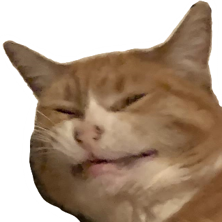
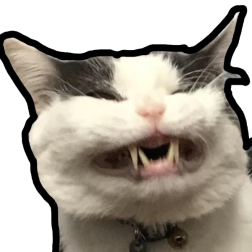
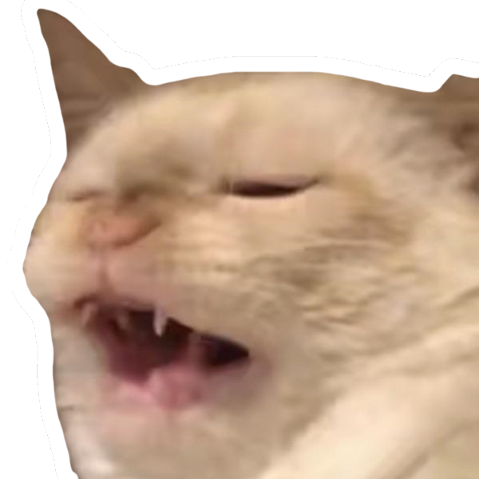

# cat-emotes

*Emotes of power.*

These original photos aren't mine and most came off of the
[r/scrungycats](https://www.reddit.com/r/scrungycats/) subreddit.
I do not own those photos but I am grateful to the people who posted them.

name|wiki|literal
-|-|-
`:disapproval:`|[disapproval](disapproval)|
`:scrunge:`    |[scrunge](scrunge)        |
`:scrumge:`    |[scrumge](scrumge)        |
`:scringe:`    |[scringe](scringe)        |
`:scrange:`    |[scrange](scrange)        |
`:scronge:`    |[scronge](scronge)        |
`:scunge:`     |[scunge](scunge)          |

To be fair, you have to have a very high IQ to understand cat emoji. The humor is extremely subtle, and without a solid grasp of nuanced emotions, most of the usage will go over a typical discorder's head. There's also scrumge's refined mixture of mutual suffering and schadenfreude, which is deftly woven into each pixel - the smile draws heavily from the pain laugh when faced with a daunting celeste level, for instance. Cat emoji users understand this stuff; they have the intellectual capacity to truly appreciate the depth of these emotions, to realize that they're not just disapproving- they say something deep about LIFE. As a consequence, people who dislike cat emoji truly ARE idiots- of course they wouldn't appreciate, for instance, the humour in scunge's reproachful yet stupefied visage. I'm scronging right now just imagining one of those addlepated simpletons scratching their heads in confusion as each cat emoji's genius unfolds itself on their discord client. What fools... how I pity them. And yes by the way, I DO have a disapproval tattoo. And no, you cannot see it. It's for the ladies' eyes only- And even they have to demonstrate that they can properly use scringe in a real sentence.
