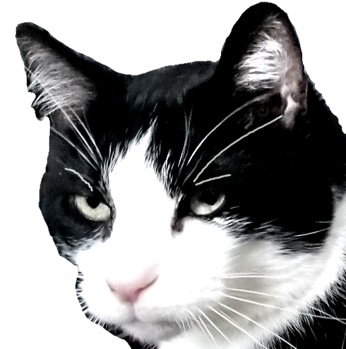
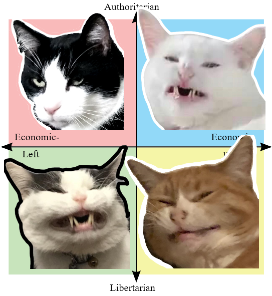

# cat-emotes

*Emotes of power.*

These original photos aren't mine and most came off of the r/scrungycats
subreddit. I do not own those photos but I am grateful of the people who posted
them. I'm pretty sure the emoji won't get me in trouble for copyright but if
someone really doesn't like their cat being used in here, please send me an
email or open an issue.

name|literal
-|-
`:disapproval:`|
`:scrunge:`    |
`:scrumge:`    |
`:scringe:`    |
`:scrange:`    |
`:scronge:`    |
`:scunge:`     |

It's kinda hard for me to describe how to use these cat emojis but this
political compass that I made as a joke actually works really well, for whatever
reason.

