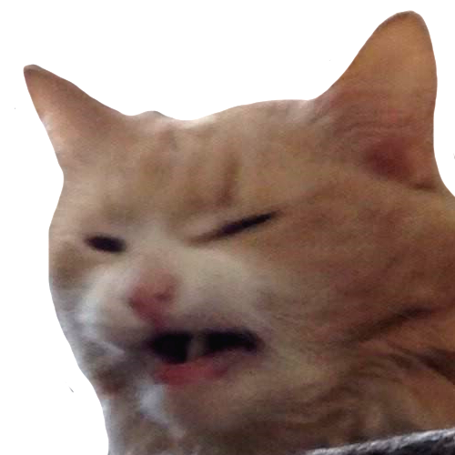

#  scrange [outcry, protest, objection]

This emote was created from the annoyance of vague / impossible instructions
from [one of my Java classes](https://github.com/coallege/Fa20.CIS.D035A.62Z).
It's purpose is to convey outright objection.

## usage

Alice: Our cs professor assigned us three labs due on the date of the midterm.

Alice: 

## where

- [Wake up scrung](https://www.reddit.com/r/scrungycats/comments/dqkhtl/wake_up_scrung/)
- [u/seronmaster](https://www.reddit.com/user/seronmaster)
