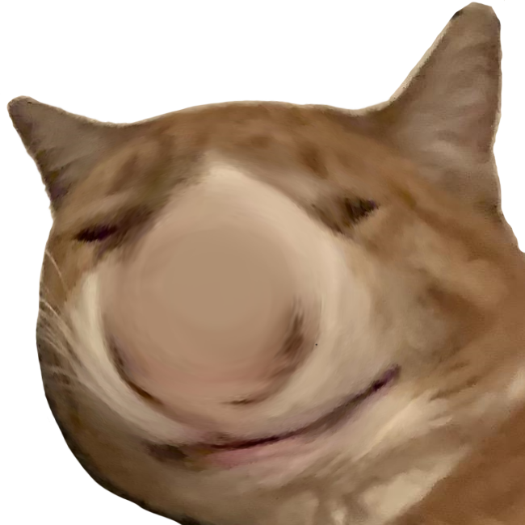

#  scunge [neutral dumb reaction]

A misspelling of `scrunge` during a conversation and the resulting "dumbness" it
created when reading it back inspired me to create a warped version of `scrunge`
named `scunge`. Originally, it kind of started off as what `sl` is to `ls`, a
joke of "you misspelled `scrunge` so you got `scunge`" but it evolved meaning
during usage.

It's one of the more nuanced ones due to it's age but the best way I can
describe it is when someone says something really dumb to you and you're just
kinda staring at them. Or like when you've said something dumb and it's like
you're just missing a piece. Perhaps the expression you make when someone makes
a bad pun and it's moderately funny but you don't want to dignify it with a
laugh and you also somewhat disapprove of it.
